* Living prompts
	* The agent evolves over time
	* The agent can be "owned" by the business
	* The users don't need to remember which agents to talk to

```mermaid
flowchart LR
    User([👤 User])
    Repo["📄 Prompt Repo (Static Text Files)"]
    LLM["🤖 Generic ChatGPT"]
    Data[("📊 Financial Data")]

    User -- "1.. Search & Copy" --> Repo
    User -- "2.. Copy Data" --> Data
    User -- "3.. Paste Everything" --> LLM
    LLM -- "4.. Output" --> User

    style User fill:#ff9,stroke:#333
    style Repo fill:#eee,stroke:#333,stroke-dasharray: 5 5
```

```mermaid
flowchart TD
    User([👤 User])
    
    subgraph Local_Runtime [💻 Local Python Script]
        Logic{Routing Logic
        static or agent-based}
        AgentA[Agent: Cost Analyst]
        AgentB[Agent: Summarizer]
        
        Logic -- "Call specific function" --> AgentA
        Logic -- "Pass output to" --> AgentB
    end

    User -- "Run Script" --> Logic
    
    style Local_Runtime fill:#e1f5fe,stroke:#01579b
    style Logic fill:#b3e5fc,stroke:#0277bd
```

```mermaid
flowchart TD
    User([👤 User])
    
    subgraph AMP_Infrastructure [⚡ AMP Platform]
        Router{🧭 Semantic Router}
        Channel[💬 Secure Channel]
    end

    subgraph Finance_Team [🏢 Finance Team Env]
        AgentA[🤖 GAAP Guardian]
    end

    subgraph Risk_Team [🏢 Risk Team Env]
        AgentB[🤖 Risk Radar]
    end

    User -- "Is this compliant?" --> Router
    Router -. "Discovery: Found Match" .-> AgentA
    Router -. "Discovery: Found Match" .-> AgentB
    
    AgentA <== "Secure Protocol" ==> Channel
    AgentB <== "Secure Protocol" ==> Channel

    style AMP_Infrastructure fill:#fff3e0,stroke:#e65100
    style Finance_Team fill:#e8f5e9,stroke:#2e7d32
    style Risk_Team fill:#fce4ec,stroke:#880e4f
    style Router fill:#ffe0b2,stroke:#f57c00
```

```mermaid
flowchart TD
    %% --- Styling Definitions ---
    classDef platform fill:#fff3e0,stroke:#e65100,stroke-width:2px
    classDef finance fill:#e8f5e9,stroke:#2e7d32,stroke-width:2px
    classDef risk fill:#fce4ec,stroke:#880e4f,stroke-width:2px
    classDef boundary fill:#ffffff,stroke:#999,stroke-dasharray: 5 5

    %% --- User Layer ---
    User(["👤 User / CFO"])
    User -- "Audit this expense" --> Router

    %% --- AMP Core Layer ---
    subgraph AMP_Platform ["⚡ AMP Infrastructure"]
        direction TB
        Router{"🧭 Semantic Router"}
    end

    %% --- Specialist Layer ---
    subgraph Finance_Silo ["🏢 Finance Team Silo"]
        direction TB
        AgentA["🤖 GAAP Guardian"]
        
        subgraph AgentA_Context ["Encapsulated Context"]
            direction LR
            PromptA[("📜 sub:gaap
            Prompt: ASC 606")]
            ToolA[/"🛠️ can:read-ledger
            Tool: DB_Read"/]
        end
        
        AgentA --- AgentA_Context
    end

    subgraph Risk_Silo ["🏢 Risk Team Silo"]
        direction TB
        AgentB["🤖 Risk Radar"]
        
        subgraph AgentB_Context ["Encapsulated Context"]
            direction LR
            PromptB[("📜 sub:fraud-pattern
            Prompt: T&E Policy")]
            ToolB[/"🛠️ can:audit-policy
            Tool: Risk_Score_API"/]
        end
        
        AgentB --- AgentB_Context
    end

    %% --- Final Basin Layer ---
    Channel["💬 Secure Channel"]

    %% --- Flow Connections ---
    Router -. "Match: sub:accounting" .-> AgentA
    Router -. "Match: sub:fraud" .-> AgentB
    
    AgentA == "✅ Secure Result" ==> Channel
    AgentB == "✅ Secure Result" ==> Channel

    %% --- Applying Styles ---
    class AMP_Platform platform
    class Finance_Silo finance
    class Risk_Silo risk
    class AgentA_Context,AgentB_Context boundary
```













**Governed State Machine**
### The "Four-Eyes" Principle for AI: Automated Governance

This workflow demonstrates how AMP transforms AI from a risky "black box" into a compliant, auditable financial system. We don't just generate data; we enforce controls.

1.  **Drafting (The Worker):** You ask the **GL Agent** to post an accrual. It accesses the data and prepares the journal entry instantly.
2.  **Validation (The Gatekeeper):** Before that entry touches the ledger, a separate **Auditor Agent** intercepts it. It checks the entry against your specific rules (e.g., budget caps, contracts). If it violates policy, it is **blocked automatically**.
3.  **The Close (The Lock):** Once the period is done, the **Controller Agent** locks the workspace. The channel becomes read-only, creating an immutable audit trail that no AI (or human) can alter retrospectively.

**The Bottom Line:** You get the speed of automation with the governance rigor of a manual audit.

```mermaid
flowchart TD
    %% --- Styling Definitions ---
    classDef human fill:#e1f5fe,stroke:#01579b,stroke-width:2px,color:#000
    classDef worker fill:#e8f5e9,stroke:#2e7d32,stroke-width:2px,color:#000
    classDef guard fill:#fff9c4,stroke:#fbc02d,stroke-width:2px,color:#000,stroke-dasharray: 5 5
    classDef admin fill:#fce4ec,stroke:#c2185b,stroke-width:2px,color:#000
    classDef locked fill:#eeeeee,stroke:#9e9e9e,stroke-width:2px,color:#999

    %% --- Actors ---
    User(["👤 Finance Manager"]):::human
    GL_Bot["🤖 GL Worker Agent\n(Drafts Entries)"]:::worker
    Auditor["🛡️ Validator Agent\n(Checks Compliance)"]:::guard
    Controller["👮 Controller Agent\n(Manages State)"]:::admin

    %% --- The Workflow ---
    
    subgraph Phase_1 ["Phase 1: Transaction Entry (Open Channel)"]
        direction TB
        Step1[User: 'Post accrual for Q3 Marketing']
        Step2[GL_Bot: 'Drafting Journal Entry #1024...']
        
        User --> Step1 --> Step2
    end

    subgraph Phase_2 ["Phase 2: The Validation Gate"]
        direction TB
        Step3{"⚠️ Validator Check"}
        
        Step2 --> Step3
        
        Step3 -- "❌ Violation: Budget Cap Exceeded" --> Reject["Block & Alert User"]:::admin
        Step3 -- "✅ Compliant" --> Approve["Post to Ledger"]:::worker
    end

    subgraph Phase_3 ["Phase 3: The Close (State Change)"]
        direction TB
        Step4[Controller: 'Closing Period for Oct 2025']
        
        Approve -.-> Step4
        Reject -.-> Step4
        
        Step4 --> Action1[AMP Action: Revoke 'can_write' for Workers]
        Action1 --> State["🔒 Channel State: READ_ONLY"]:::locked
    end

    %% --- Connections & Context ---
    Auditor -.-> Step3
    Controller -.-> Step4
    
    %% --- Annotations ---
    linkStyle 3 stroke:#d32f2f,stroke-width:3px
    linkStyle 4 stroke:#388e3c,stroke-width:3px
```




```
We need to cut costs immediately. @The Hawk, scan the Q3 data for duplicate vendors or excessive T&E. Contact Risk Radar, verify if these are contractually obligated or cancellable waste. Ask the Summeriser agent to produce an Ex summary.
```

```
@The Hawk, show me the 'Assets' category from the Q3 file. Contact GAAP Guardian, I need a technical memo on whether these are correctly classified
```