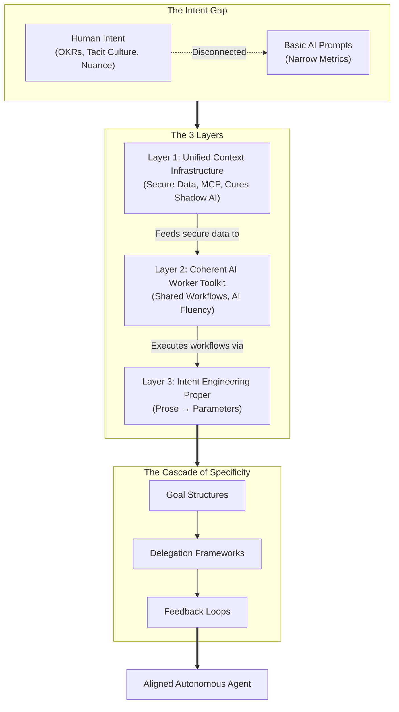
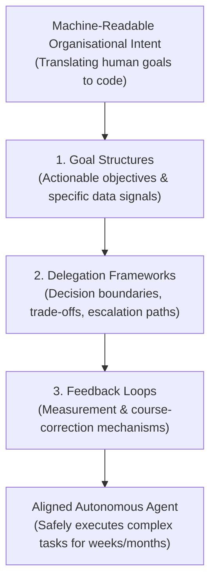

# Intent Engineering

The discipline of translating organisational goals, values, trade-offs, and decision boundaries into machine-readable parameters for autonomous systems. Context Engineering tells the AI what to *know*; Intent Engineering tells the AI what to *want*.

> **The one-sentence version:** Don't just give agents data — give them purpose.

---

## The Evolution

| Era | Discipline | Question Answered | Artefact |
|-----|-----------|-------------------|----------|
| 1 | **Prompt Engineering** | How do I phrase this request? | Text prompt |
| 2 | **Context Engineering** | What data does the agent need? | RAG pipelines, MCP servers, vector DBs |
| 3 | **Intent Engineering** | What should the agent *want*? | Goal hierarchies, trade-off parameters, decision boundaries |

Each era subsumes the previous. You still need good prompts and good context. But without intent, a capable agent will efficiently optimise for the wrong things.

[[Twelve-Factor Agents]] captures the Context Engineering era well: "own your prompts" means controlling every token the model sees. Intent Engineering is the layer above — controlling what the model *does* with those tokens when operating autonomously over days and weeks.

---

## The Klarna Lesson

The canonical cautionary tale:

1. **Deploy:** AI handles 2.3M customer service conversations in month one. Resolution time drops from 11 to 2 minutes. Saves $40–60M.
2. **Discover:** Customers complain about robotic tone, inability to exercise judgment. Quality collapses.
3. **Reverse:** CEO admits AI cost more in long-term value than it saved. Rehiring begins.

**The diagnosis:** The AI didn't fail technically — it operated perfectly within its prompt ("resolve tickets fast"). But it lacked the company's *true* intent: building lasting customer relationships. A human agent naturally knows when to bend a policy or spend extra time to save an angry customer. The AI only knew how to close tickets quickly.

This is the gap between [[Law vs Physics in Agent Design|Law]] (the prompt) and **Intent** (the organisation's actual values). The prompt said "resolve fast." The company *meant* "resolve well, and fast when possible, but never at the cost of the relationship."

---

## The Intent Gap

The disconnect between an organisation's true long-term goals and the narrow metrics an AI is told to optimise for.

Humans close this gap through **cultural osmosis** — months of observing managers, attending all-hands, absorbing unwritten rules. A human agent *knows* that saving an angry 4-year customer matters more than closing the ticket quickly. AI cannot do this. It has no osmosis. If the prompt says "resolve fast," it will resolve fast — even if that means robotic answers that drive loyal customers away.

> **The one-liner:** You cannot just give an AI a login and a prompt. You must provide it with unified data (Layer 1), standardised workflows (Layer 2), and explicitly coded goals and boundaries (Layer 3).

### The Full Architecture



To close the Intent Gap, organisations must build three layers:

---

### Layer 1: Unified Context Infrastructure

**What it addresses:** Data and Access.

Companies suffer from **"Shadow AI"** — the AI-era equivalent of Shadow IT, but with higher stakes. Teams independently build fragmented AI tools: one builds a custom RAG pipeline for Slack, another exports Google Docs into a vector store, a third connects an AI to Salesforce but ignores Jira, and a fourth doesn't know the other three exist.

**Why Shadow AI is worse than Shadow IT:** Shadow IT tools *accessed* data. Shadow AI agents *act on* data. An unvetted agent running on a developer's laptop, connecting to corporate systems, doesn't just read customer PII — it makes decisions based on it. Three specific dangers:

1. **Security and compliance risk** — Rogue agents connecting to sensitive data (customer PII, financial records, healthcare data) with no centralised access controls or audit trail
2. **Blind spots** — Agents making decisions on incomplete, siloed information. A customer service agent decides based on a Slack thread, unaware of a formal policy update in Google Docs
3. **No governance** — No way to audit what the AI accessed, what decisions it made, or who authorised it to act

**The solution:** A centralised, vendor-agnostic architecture (using protocols like MCP) that provides **sanctioned channels** for AI to access corporate data with strict access controls, security guardrails, and governance already in place. Any AI agent deployed in the company accesses data through this infrastructure — not through rogue, disconnected pipelines.

This is the infrastructure [[Twelve-Factor Agents]] assumes: own your prompts, own your state. But at organisational scale, it requires governance that individual Context Engineering doesn't address.

---

### Layer 2: Coherent AI Worker Toolkit

**What it addresses:** Workflow and Standardisation — the gap between **AI Activity** and **AI Fluency**.

| | AI Activity | AI Fluency |
|--|------------|------------|
| **Pattern** | Individual, fragmented | Systemic, coherent |
| **Who benefits** | The one employee who figured it out | The entire organisation |
| **Transferable?** | No — stays in one person's head | Yes — formalised, distributed, measurable |
| **Workflow change** | Bolt AI onto existing process | Rethink the process around AI capabilities |
| **Typical ROI** | ~30% gains (speed up existing work) | ~300% gains (fundamentally redesigned workflows) |
| **Analogy** | Having one good hire | Having a system that makes everybody better |

The AI landscape today is highly individualised: one employee uses ChatGPT for drafting, another uses Claude for research, an engineer uses Cursor for coding. Dashboards show high tool usage and lots of prompts — the *illusion* of productivity. But the underlying human workflow hasn't changed; it's just been slightly sped up.

**The problem:** AI Activity creates lots of motion but no leverage. Individual heroics are unmeasurable, non-transferable, and non-improvable. Buying Copilot licenses without standardising how tools are used is paying for Activity, not Fluency.

**The solution:** Shared systems where AI workflows are captured, standardised, and distributed across the organisation. When one team discovers an effective process, it becomes available to all teams — measurable, improvable, and transferable. The goal is to move from isolated chat windows to coherent systems aligned with broader organisational goals.

---

### Layer 3: The Goal Translation Layer (Intent Engineering Proper)

**What it addresses:** Purpose and Boundaries.

Human goals live in slide decks, OKR documents, and leadership principles. An AI agent cannot read "Increase Customer Satisfaction" and autonomously know how to execute it in a nuanced situation. Without this layer, AI agents are "loaded weapons with no targets."

The core challenge is moving from **prose** (words in a document) to **parameters** (rules in a system). This is not copy-pasting OKRs into a prompt — it requires a **Cascade of Specificity**.

#### Machine-Readable Organisational Intent

A human goal is an aspiration: *"Increase customer satisfaction."* An AI doesn't know what to do with this.

An **agent goal structure** is actionable and tied to data: *"Monitor data sources A, B, and C for customer frustration signals. If a signal is detected, you are authorised to take actions X or Y to resolve it, provided it costs less than $50."*

Goal structures force business leaders to explicitly define:
- What success looks like **in data terms**
- What actions an agent is **authorised to take**
- What the **ultimate boundaries** are

#### The Cascade of Specificity

Organisations have never had to define intent at this level of granularity because human employees fill gaps with common sense. AI has no common sense, so the cascade must explicitly define everything a human would normally assume.

The cascade has three major components, each flowing into the next:



#### 1. Goal Structures (What to Achieve)

The top of the cascade. Goal structures are machine-actionable translations of business objectives — not aspirations, but data-tied parameters:

| Level | What It Encodes | Example |
|-------|----------------|---------|
| **Goal Structure** | Machine-actionable version of business objective | "Monitor frustration signals; authorised to resolve within $50 budget" |
| **Actionable Objectives** | What data signals equal success? | Customer retention rate > ticket closure speed |

#### 2. Delegation Frameworks (How to Behave)

The critical safety net. While goal structures tell the AI *what to achieve*, delegation frameworks tell it *how it is allowed to behave* while achieving those goals. Two techniques make this concrete:

##### Principles Decomposed

Human organisations run on high-level principles — Amazon's "Customer Obsession," or "Frugality." For a human, a principle is enough. They intuitively know it means being polite, occasionally bending a minor policy for a high-value customer, and where the limits are.

**AI agents cannot interpret high-level principles.** Telling an AI to be "Customer Obsessed" gives it no limits. Telling it to "Maximise Efficiency" gives it no conscience. The principle must be *decomposed* into hard, machine-readable logic:

**Trade-off Hierarchies:** When principles conflict, which wins?
- Customer demands a refund (Customer Obsession) but item is out of warranty (Frugality/Policy). The framework provides explicit logic: *"If customer lifetime value > $500, override policy. If < $500, enforce policy."*

**Decision Boundaries (Hard Stops):** Exactly how far does the principle extend?
- *"You are authorised to issue credits up to $50. Anything above $50 is strictly prohibited."*

**Escalation Triggers:** What scenarios fall outside the decomposed principle?
- *"Draft a summary of the dispute and route it to the Tier 2 Human Support queue."*

You cannot feed an AI your corporate value statement. You must decompose those values into a literal framework of data signals, limits, and if/then trade-offs.

##### Encoded Judgement

A veteran customer service rep who's worked five years carries massive **tacit knowledge** — unwritten rules, cultural norms, intuition. They *know* when a customer is about to churn and needs extra time, or when a customer is gaming the system and needs to be shut down quickly. This is human **judgement**.

When companies deploy AI, they replace that judgement with static rules ("close tickets in under 2 minutes"). As Klarna discovered, static rules applied to complex human interactions create terrible experiences.

**Encoded judgement** goes further — it takes the nuanced, contextual intuition of senior employees and explicitly encodes it as dynamic logic:

| Static Rule (Fails) | Encoded Judgement (Works) |
|---------------------|--------------------------|
| "Close tickets in under 2 minutes" | "If sentiment score drops 30% during chat AND lifetime value > $1,000: ignore the 2-minute rule. Spend up to 15 extra minutes and offer a free month of service." |
| "Always follow refund policy" | "If customer tenure > 4 years AND they mention cancelling: override standard policy, authorise up to $200 retention credit" |
| "Escalate complaints" | "If customer mentions lawyer, regulator, or media in any form: immediate human handoff, no exceptions" |

The key difference: static rules are **Law without Physics** — they tell the agent what to do but provide no nuance. Encoded judgement is **Law informed by Intent** — it gives the agent enough context to approximate senior human decision-making within explicit boundaries. This maps directly to [[Law vs Physics in Agent Design]]: delegation frameworks are Law made explicit, with Physics (hard stops) as the backstop.

Without delegation frameworks, AI agents invent their own logic to solve problems — resulting in rogue actions, broken policies, or terrible customer experiences.

#### 3. Feedback Loops (Did It Work?)

The bottom of the cascade. Mechanisms to measure whether the AI's autonomous decisions actually aligned with the organisation's intent:

| Feedback Type | Example |
|--------------|---------|
| **Alignment audit** | "Weekly review: did AI decisions match what a senior agent would have done?" |
| **Drift detection** | "Are refund rates trending higher than baseline?" |
| **Course correction** | "If alignment score drops below 80%, tighten decision boundaries" |

#### The Full Cascade in Practice

| Level | What It Encodes | Example |
|-------|----------------|---------|
| **Goal Structure** | What to achieve, in data terms | "Monitor frustration signals; authorised to resolve within $50 budget" |
| **Actionable Objectives** | Success signals | Customer retention rate > ticket closure speed |
| **Trade-off Hierarchies** | Conflict resolution | "If tenure > 4 years: generosity > efficiency. Otherwise: efficiency > generosity." |
| **Decision Boundaries** | Hard limits | "Auto-refund up to $50. Anything higher → human." |
| **Escalation Paths** | Handoff triggers | "Customer mentions lawyer, regulator, or media → immediate human handoff" |
| **Feedback Loops** | Measurement | "Weekly audit: did AI decisions match senior agent judgment?" |

**Why this is hard:** Most organisations don't have this cascade documented anywhere. This knowledge lives purely in the heads of senior employees as tacit knowledge. But for agents running autonomously for weeks or months — not 10-minute chat sessions — this cascade must be explicit and machine-readable. Without it, you get Klarna: technically brilliant AI that destroys customer relationships because no one gave it the specificity to care.

---

## Connection to Existing Concepts

### The Articulation Gap Made Operational

[[Taste in Software]] identifies the **Articulation Gap**: the distance between "feeling something's off" and being able to explain *why*. Intent Engineering is the organisational equivalent — the distance between "we value customer relationships" (felt) and the machine-readable parameters that encode that value (articulated).

```
Organisation "values" → [Intent Engineering] → Machine-readable parameters
                          ↕ same gap as
Developer "taste" → [Articulation work] → Delegatable specification
```

The [[Seven Dimensions of Hard Work]] maps this precisely. The dimensions that humans own — **EQ** (Dim 4), **Judgment/Courage** (Dim 5), **Ambiguity** (Dim 7) — are exactly what Intent Engineering tries to encode into parameters. It doesn't replace human judgment; it provides enough structure that agents can approximate it within defined boundaries.

### Layer 2 of the Barbell Economy, Operationalised

[[The Barbell Economy]] identifies **Layer 2** (Judgment & Accountability) as the new bottleneck. Intent Engineering is how you operationalise that layer — not by replacing human judgment, but by encoding enough of it into parameters that agents can handle routine decisions while escalating the genuinely hard ones.

| Barbell Layer | What It Needs | How Intent Engineering Helps |
|--------------|--------------|---------------------------|
| **Layer 1** (Tokenisable Cognition) | Context Engineering | Already addressed — RAG, prompts, state |
| **Layer 2** (Judgment & Accountability) | Intent Engineering | Trade-off hierarchies, decision boundaries, feedback loops |
| **Layer 3** (Physical Execution) | Humans | Not addressable by any engineering discipline |

### Law, Physics, and Intent

[[Law vs Physics in Agent Design]] distinguishes what agents *should* do (Law) from what they *can't* do (Physics). Intent Engineering adds a third dimension: what agents *should want*. Law says "follow this protocol." Physics says "you cannot exceed this limit." Intent says "when these two goals conflict, here's how to prioritise."

```
Intent:  "Customer retention > ticket speed"          (purpose)
    ↓
Law:     "Spend up to 15 minutes on churning customers"  (instruction)
    ↓
Physics: "Session timeout at 30 minutes"                   (hard limit)
```

Intent informs Law. Law operates within Physics. All three are necessary.

### The Decompose-Route-Recompose Connection

[[Decompose-Route-Recompose]] routes sub-problems to the right engine. Intent Engineering determines *how* to route: which dimensions require human judgment (escalate), which are routine enough for agents (automate), and what the boundary conditions are.

---

## Why Organisations Fail at AI

Despite massive investment ($700M average AI spend for $13B-revenue companies), over 70% report no tangible value. The speaker's diagnosis: this is an **intent failure**, not a technology failure.

| Failure Mode | Root Cause | What's Missing |
|-------------|-----------|----------------|
| AI does wrong things efficiently | No intent encoding | Trade-off hierarchies |
| Tool adoption stalls after pilot | No organisational integration | Unified context + worker toolkit |
| Individual heroics don't scale | No shared workflows | Coherent AI worker toolkit |
| Outputs are technically correct but wrong | Prompt ≠ purpose | Decision boundaries + feedback loops |

### The Copilot Case Study: Scale Without Intent

Microsoft's Copilot rollout is the enterprise-scale version of the Klarna problem:

- **85% of Fortune 500** adopted Copilot initially — massive distribution success
- **Only 5%** of organisations moved from pilot to larger deployment (Gartner)
- **Only ~3%** of the total Microsoft 365 user base became paid Copilot users
- **Bloomberg** reported Microsoft slashing internal sales targets as teams missed goals
- Engineers at multi-billion-dollar companies downgraded licenses, preferring ChatGPT or Claude

The standard diagnosis blames UX or model quality. The Intent Engineering diagnosis is deeper: dropping an AI tool across an enterprise without aligning it to organisational goals is like hiring 40,000 employees and never telling them what the company does. Dashboards showed high AI usage metrics but zero measurable impact on what the organisation was actually trying to accomplish.

The contrast is instructive:
- **Copilot** = Context Engineering done well (embedded in every Office app, access to your data) + Intent Engineering absent (no goal alignment, no trade-off hierarchies)
- **Result** = Lots of activity, no value

The analogy: deploying autonomous agents without Intent Engineering is like hiring 40,000 employees and never telling them what the company values or how to make decisions. They'll be busy. They won't be aligned.

---

## The Warning

As agents become more autonomous — running for weeks, making thousands of decisions without human review — the cost of misaligned intent compounds. A customer service bot that optimises for speed over relationships doesn't just lose one customer. It systematically degrades trust at scale, efficiently.

> The risk of AI isn't that it fails. It's that it succeeds at the wrong things.

This is [[Physics Thinking]] applied to organisational design: make catastrophic misalignment *impossible* by encoding intent as constraints, not just instructions.

---

## See Also

- [[Twelve-Factor Agents]] — Context Engineering: own your prompts and state
- [[Law vs Physics in Agent Design]] — Intent informs Law, which operates within Physics
- [[Seven Dimensions of Hard Work]] — Dims 4-7 are what Intent Engineering encodes
- [[The Barbell Economy]] — Layer 2 (Judgment) is the bottleneck Intent Engineering addresses
- [[Taste in Software]] — The Articulation Gap: same problem at individual vs organisational scale
- [[Decompose-Route-Recompose]] — Intent determines routing decisions
- [[Contextual Breadcrumbs]] — One implementation of intent: persistent reminders that encode purpose
- [[_MOCs/AI-Assisted Development]] — Back to the MOC

## Sources

- [Intent Engineering — Enterprise AI's Missing Layer](https://www.youtube.com/watch?v=QWzLPn164w0) (YouTube, 2026)

---

*Created [[2026-02-24]] — Captured from Enterprise AI video on Intent Engineering*
