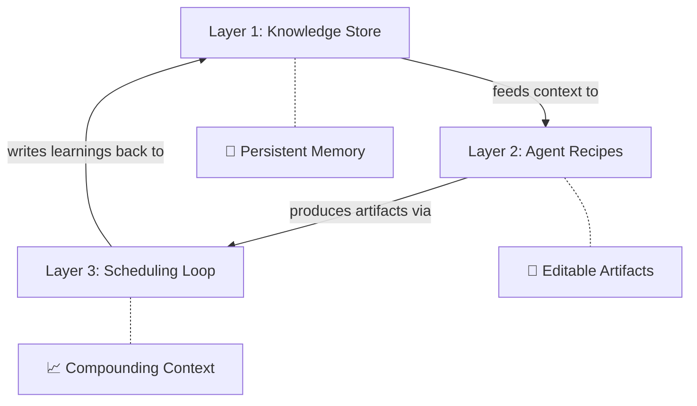

# Outcome Agent Architecture

A three-layer architecture for building custom AI agents that produce outcomes, not chat responses. Each layer maps to a core principle: **persistent memory**, **editable artifacts**, and **compounding context**.

> **The one-sentence version:** Wire a knowledge store, agent recipes, and a scheduling loop together — and you get an agent that knows you, produces tangible work, and gets better over time.

---

## Why Chat Interfaces Fail

Default chat is stateless and output-invisible. Every session starts from zero, every response vanishes into a scroll buffer. This means:

- **No memory** — the agent doesn't know who you are, what you've done, or what you care about
- **No artifacts** — output is trapped in a chat window, not in editable documents you can act on
- **No compounding** — the tenth task is exactly as hard as the first

The three-layer architecture solves each of these by separating concerns into distinct, independently upgradeable layers.

---

## The Three Layers

### Layer 1: Knowledge Store (Persistent Memory)

The foundational substrate where the agent's memory lives — separate from the model, separate from the conversation.

**Function:** Holds all the context the agent needs to do its job, rather than relying on a blank-slate chat interface every time.

**Implementation options:**
- Postgres database for structured data
- MCP (Model Context Protocol) connections for live integrations
- File-based knowledge (like this Obsidian vault itself)

**Key design principle:** Memory is "chunked out and separate." By keeping data storage independent from the AI model, you can:
- Update memory dynamically between sessions
- Interact with the model separately from the data layer
- Ensure the agent actually knows who you are and what your ongoing goals are

This is the same insight behind [[AI Second Brain Architecture]] — move from passive storage to an active system. But where AI Second Brain focuses on *capture and classify*, the Knowledge Store focuses on *feed and ground*: ensuring the agent has durable context every time it acts.

It also connects to [[Twelve-Factor Agents]]' Factor 3 (manage state explicitly in a database) — the Knowledge Store *is* that database, purpose-built for agent consumption rather than human browsing.

### Layer 2: Agent Recipes (Editable Artifacts)

Pre-wired workflows designed for specific outcomes — the modern equivalent of punch cards.

**Function:** Instead of free-form chatting, you pick a recipe — a structured set of instructions that tells the agent exactly what kind of artifact to produce.

**The punch card analogy:** Like old-school computing punch cards, each recipe is a specific instruction set you "feed" to the computer. The conversation isn't the product; the *artifact* is.

**Examples:**
- A **calendar workflow** that reviews your week and produces a prioritised schedule
- A **meeting workflow** that takes notes, extracts action items, and updates the knowledge store
- A **document workflow** that drafts memos from structured inputs
- A **presentation workflow** that generates slide decks from brief outlines

**Design goal:** Recipes must be "good at producing artifacts you can see and edit" — not opaque text in a chat window. The output should be a document, spreadsheet, slide deck, or structured data file that the user can review, modify, and ship.

This aligns with the distinction between [[Commitment Loops|pseudo-work and real work]]. A recipe that produces a chat summary is pseudo-work (another thing to read). A recipe that produces an editable report sent to the right people is real work (a loop closed).

### Layer 3: Scheduling Loop (Compounding Context)

The operational layer that allows the agent to act autonomously and improve over time.

**Function:** Runs tasks on a schedule rather than just manually, one at a time. Critically, the loop feeds results and learnings back into Layer 1 (the Knowledge Store), creating a flywheel.

**Why it matters:** The scheduling loop ensures the agent "gets better over time." By allowing the agent to:
- Run on a schedule (not just when triggered)
- Come back and evaluate previous runs
- Write learnings into the Knowledge Store

...the context **compounds**. The tenth task the agent performs is easier and more accurate than the first, because it has nine runs of accumulated context to draw on.

This is [[Agentic Primitives]]' **Scheduled Tasks** primitive taken to its logical conclusion — not just recurring background work, but recurring background work that *teaches* the agent. And it connects to [[Context Distillation Loop - amnesia as a feature|Context Distillation Loops]]: each scheduled run is a session boundary that forces re-articulation, and what survives is signal that accumulates in the Knowledge Store.

---

## The Flywheel Effect

The three layers aren't just stacked — they form a cycle:

1. **Knowledge Store** grounds the agent with persistent context
2. **Agent Recipes** use that context to produce tangible artifacts
3. **Scheduling Loop** runs recipes autonomously and writes learnings back to the Knowledge Store
4. Each cycle makes the next one better → compounding context

This is why chat interfaces can never reach this: they have no Layer 1 (no memory between sessions) and no Layer 3 (no autonomous improvement loop). Even if you prompt perfectly, you're resetting to zero every time.

---

## Connection to Existing Concepts

### Agentic Primitives

[[Agentic Primitives]] defines the three *building blocks* (Scheduled Tasks, Dispatch, Computer Use). Outcome Agent Architecture defines the three *layers* that organise those building blocks into a coherent system. Scheduled Tasks map directly to Layer 3; Dispatch enables Layer 2 recipes to run in parallel; Computer Use extends Layer 2's reach to legacy systems.

### AI Second Brain Architecture

[[AI Second Brain Architecture]] is essentially a Layer 1 implementation — it solves capture, classification, and retrieval. Outcome Agent Architecture extends this by adding Layers 2 and 3: structured output (recipes) and autonomous improvement (scheduling loop).

### Twelve-Factor Agents

[[Twelve-Factor Agents]]' "manage state explicitly" and "own your prompts" map to Layers 1 and 2 respectively. The architecture gives these engineering principles a user-facing shape.

### Commitment Loops

[[Commitment Loops]] asks: "after the AI finishes, is the task *done*?" The recipe layer (Layer 2) is designed specifically to produce closed-loop artifacts, and the scheduling layer (Layer 3) ensures recurring commitments don't need manual triggering.

---

## Open Brain

The speaker is building **Open Brain**, an open-source project using this three-layer architecture. The goal: allow people to build their own outcome-focused agents cheaply, rather than relying on expensive proprietary SaaS products. This aligns with the self-hosted vs managed tension explored in [[Agentic Primitives#Self-Hosted vs Managed Infrastructure]].

---

## See Also

- [[Agentic Primitives]] — The building blocks (Scheduled Tasks, Dispatch, Computer Use)
- [[AI Second Brain Architecture]] — Layer 1 in practice: capture, classify, retrieve
- [[Twelve-Factor Agents]] — Engineering discipline for agent state and prompts
- [[Commitment Loops]] — Why artifacts matter: close loops, don't add reading
- [[Context Distillation Loop - amnesia as a feature|Context Distillation Loops]] — Session boundaries as compounding mechanism
- [[Agentic Harness Primitives]] — Infrastructure that sustains all three layers in production
- [[Conway and Intelligence Portability]] — Anthropic's enterprise implementation of this architecture (locked inside their stack)
- [[_MOCs/AI-Assisted Development]] — Back to the MOC

## Sources

- [Three-Layer Agent Architecture (YouTube)](https://youtu.be/D-Ww1wLIp60?si=F7rJze31TCv59OJK)

---

*Created [[2026-04-05]] — Captured three-layer architecture for outcome-focused AI agents*
