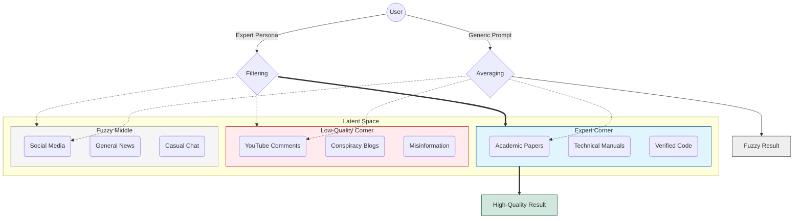
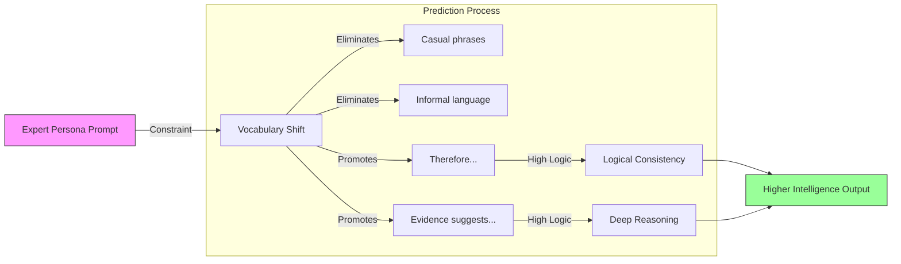
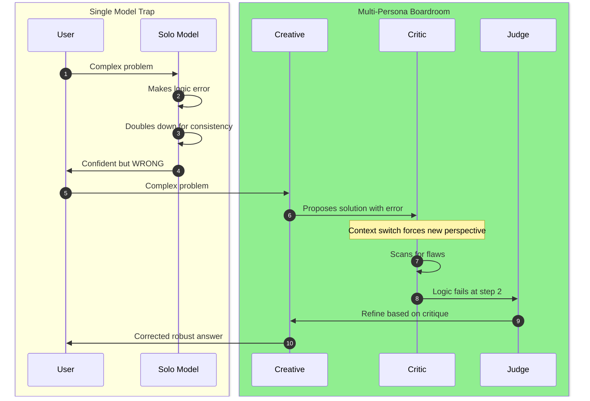

# LLM Specialisation and Multi-Persona

Specialisation turns a "fuzzy" generalist into a sharp expert. A "digital boardroom" beats a solitary thinker.

LLMs are simulators. Ask them to simulate a "generic person," they simulate average intelligence. Ask them to simulate a "genius," they restrict predictions to genius-level patterns.

---

## The "Fuzzy" Idea: The Law of Averages

Without a specific persona or constraint, an LLM defaults to the **statistical average** of its training data.

Training data contains:
- Wikipedia, academic papers, high-quality code
- Reddit threads, YouTube comments, misinformation

A generic question like "How do I fix a leaky pipe?" navigates the *center* of that data — the most probable, common-denominator answer. It's "fuzzy" because it tries to satisfy the patterns of *all* the text it has ever seen at once.

---

## Specialization: Navigating Latent Space

LLMs store knowledge in a high-dimensional map called **Latent Space**. Imagine a massive 3D library where every concept has a coordinate:
- In one corner: "Medical Textbooks"
- In another: "Science Fiction"
- In another: "Internet Slang"

### The Spotlight Effect

| Prompt Type | Model Position | Influences |
|-------------|----------------|------------|
| Generic prompt | Middle of library | Slang, textbooks, fiction equally |
| "You are a senior plumbing expert with 20 years experience" | "Expertise" corner | Technical manuals, expert forums |

**Why this works:** In training data, words like "consequently," "mitigate," and technical jargon usually appear next to **correct, high-logic answers**.

By forcing the model to adopt the *persona* of an expert, you force it to use the *vocabulary* of an expert. Because vocabulary and logic are tied together in training data, **mimicking the style of an expert forces the model to access better reasoning.**



### The Persona-Logic Chain

This explains *why* acting like an expert makes the model smarter — "roleplay" restricts the vocabulary, which restricts the available logical paths to only the most rigorous ones.



**Key insight:** Specialization isn't adding new knowledge — it's **ignoring** bad knowledge. Intelligence in LLMs is often a byproduct of vocabulary. Using "smart words" forces the model into "smart patterns."

---

## Multi-Persona: Why 3 > 1

Three simulated personalities having a conversation works better than one model thinking alone. This is the **Ensemble Effect** or **Multi-Agent Debate**.

### A. Breaking the "Yes-Man" Cycle (Sycophancy)

LLMs are trained to be helpful assistants, creating a bias toward agreement. A single model starting down a wrong logical path tends to double down to remain consistent.

With three conflicting personas (e.g., "The Creative," "The Critic," "The Realist"):
- Agent A proposes an idea
- Agent B is *programmed* to look for flaws
- The model generates tokens that criticize its own previous output — something statistically unlikely on its own

### B. Fact-Checking Hallucinations

Hallucinations happen when the model takes a "probabilistic wrong turn."

| Single Model | Multi-Persona |
|--------------|---------------|
| Wrong turn becomes the reality | Statistical likelihood of *all three* making the *exact same* error is much lower |
| No self-correction | If Agent A hallucinates, Agent B (referencing different latent space) spots the inconsistency |

### C. Cognitive Load and Diversity

| Single Model | Multi-Persona |
|--------------|---------------|
| Must be creative, logical, critical, and organized simultaneously | Each persona focuses on one aspect |
| Attention mechanism spread thin | Full processing power on one aspect at a time |

**Division of labor:**
- Persona 1: **Generation** (Creativity)
- Persona 2: **Verification** (Logic)
- Persona 3: **Synthesis** (Summary)

---

## The Boardroom vs. The Yes-Man

This compares the failure mode of a single LLM (doubling down on errors) against the success mode of a Multi-Persona setup (the Ensemble Effect).



The benefit of multiple personalities is breaking the **consistency loop**. A single model tries to agree with itself; multiple models are forced to disagree, revealing the truth.

---

## Practical Pattern: Simulated Stakeholder Panel

Combine **multi-persona** with **deliberate amnesia** to simulate asking a group of people about a feature or decision:

```
Main agent: "Who should we ask about feature X?"
     ↓
Spawn subagents with amnesia + distinct personas:
  - "Senior Security Engineer" → reviews for vulnerabilities
  - "End User (non-technical)" → reviews for usability
  - "Finance/Procurement" → reviews for cost implications
  - "Support Team Lead" → reviews for maintainability
```

**Why this works:**
- Each subagent has a **fresh perspective** (amnesia removes accumulated bias)
- Each persona **conditions the distribution** toward domain expertise
- Multiple viewpoints **break groupthink** that a single agent would have
- You get a simulated stakeholder review without scheduling meetings

**The pattern:** Identify whose perspective matters → spawn subagents with those personas → aggregate their feedback.

### Example: A2UI Implementation Review Panel

| Persona | Focus | Why (What They Catch) |
|---------|-------|----------------------|
| **A2UI Spec Purist** | Wire format conformance, field mapping completeness, edge cases in v0.9 spec | Spec gaps we might have rationalized away |
| **Go Systems Engineer** | Idiomatic Go, error handling, concurrency safety, SQL correctness | Code-level bugs and anti-patterns |
| **Adversarial Tester** | Malformed input, injection, DoS vectors, boundary conditions | What breaks when agents send garbage |
| **Integration Architect** | How rotated graph is consumed by UI, backward compat, SSE flow | Mismatches between what we produce and what frontend expects |

Each persona catches something the others wouldn't prioritize. That's the value of the panel.

See also: [[Context Distillation Loop - amnesia as a feature]] for the amnesia pattern, [[Conditioning the Distribution]] for why personas work.

---

## Key Takeaways

1. **Specialization** isn't adding knowledge — it's ignoring bad knowledge
2. **Intelligence** in LLMs is often a byproduct of vocabulary constraints
3. **Multi-persona** breaks the consistency loop where single models agree with themselves
4. **Cognitive division** allows full processing power on one aspect at a time

---

## Related Concepts

- [[Conditioning the Distribution]] — The statistical framing: variance reduction + mean shift
- [[Thinking Out Loud]] — Post-hoc conditioning via self-rating
- [[Agents vs Long Context]] — Different trade-off: serial discovery vs. holistic synthesis
- [[The Great Inversion]] — Execution is cheap; use multiple approaches
- [[Leverage Selection]] — Multi-persona applies leverage at the structure level (forcing disagreement)

## See Also

- [[_MOCs/AI-Assisted Development]] — Back to the MOC
