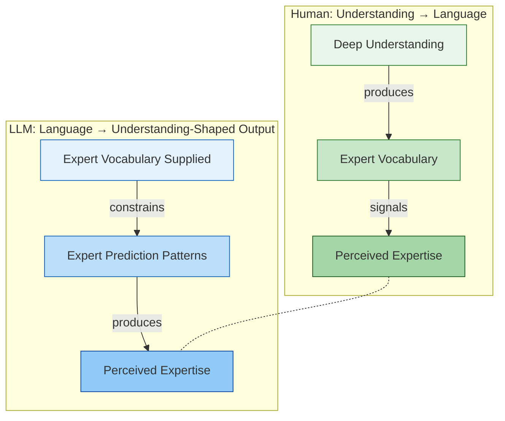
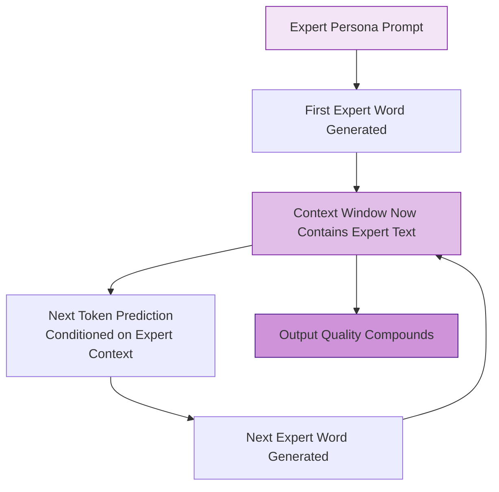

# The Inverted Causality of Language

In humans, expertise produces expert language. In LLMs, expert language produces expertise. The arrow of causality is reversed — and the output can look identical.

This is the deeper "why" behind [[Conditioning the Distribution]] and the [[Teams Of Agents - LLM Specialisation+Personas|Persona-Logic Chain]].

---

## The Human Model: Think → Speak

A human expert has spent years building internal mental models — compressed experience, pattern recognition, intuition. When they speak, expert vocabulary *emerges naturally* from that understanding.

You can sense someone's expertise by their language. An experienced engineer doesn't say "consequently" and "mitigate" to sound smart — those words are the natural output of how they think. **Language is a symptom of cognition.**


**The signal:** When we hear someone use precise, domain-specific language fluently, we infer deep understanding. The words are evidence of something real underneath.

---

## The LLM Model: Speak → "Think"

An LLM has no internal mental model, no experience, no intuition. But it has absorbed the *statistical patterns* of expert text. When you supply expert vocabulary via a persona prompt, the model's token predictions are constrained to follow the patterns that expert vocabulary typically precedes.

The words aren't a symptom of understanding — they're the **mechanism that produces understanding-shaped output**.


**The mechanism:** Expert words predict expert words. "Consequently" is statistically more likely to be followed by logically sound reasoning than "anyway" is — because in the training data, that's how expert text works.

---

## The Inversion

The same observable output — articulate, domain-specific, logically coherent language — is produced by opposite causal chains:



| | Human | LLM |
|--|-------|-----|
| **Cause** | Internal understanding | External vocabulary |
| **Direction** | Inside → out | Outside → in |
| **Language is** | A symptom of thought | A driver of "thought" |
| **Expertise comes from** | Years of experience | Statistical proximity to expert text |
| **The words** | Emerge from understanding | Produce understanding-shaped output |
| **Without the expertise** | Language degrades (they can't fake it sustainably) | Language *is* the expertise (no separate substrate) |

---

## The Self-Reinforcing Loop

This inversion explains why LLM output can feel eerily competent. Once expert vocabulary enters the prediction window, it creates a **self-reinforcing loop**:



Each expert word makes the next expert word more likely. The model "warms up" into a domain — early tokens set the trajectory, and the output gets progressively more domain-specific. This is why a good system prompt has outsized impact: it sets the initial vocabulary trajectory that compounds through the entire response.

---

## Why This Matters

### For Prompting

If language *drives* LLM reasoning rather than *reflecting* it, then prompt design is not about "asking the right question" — it's about **seeding the right vocabulary**. The persona isn't decoration; it's the mechanism.

This reframes prompting from "how do I ask?" to "what language environment do I create?"

### For Trust Calibration

The inversion creates a trust problem. With humans, expert language is a reliable signal of expertise — it's hard to sustain expert vocabulary without genuine understanding. With LLMs, expert language is the *starting point*, not evidence of anything underneath.

This means we need different heuristics for evaluating LLM output. Fluency and vocabulary are not signals of correctness — they're *inputs*, not *outputs*. The thing to check is whether the reasoning holds, not whether it sounds expert.

### For the "Are LLMs Thinking?" Debate

This concept sidesteps the philosophical question. It doesn't matter whether the LLM is "really" thinking. What matters is:
- In humans: thought produces language (causal)
- In LLMs: language produces thought-shaped output (statistical)
- The practical output can be equivalent

The inversion is functional, not metaphysical. For the purposes of getting work done, the distinction matters less than understanding which direction the arrow points — because that tells you **where to intervene** to get better results.

For humans: improve their understanding, and better language follows.
For LLMs: improve the language environment, and better output follows.

---

## Connection to Existing Concepts

### [[Teams Of Agents - LLM Specialisation+Personas|The Persona-Logic Chain]]
Provides the mechanism — vocabulary constrains logic. This note explains *why* that mechanism works: because it reverses the human causality chain, using language as the driver rather than the signal.

### [[Conditioning the Distribution]]
The statistical framing. The inversion explains *why* conditioning works: you're not informing the model, you're constraining which vocabulary — and therefore which reasoning patterns — it can access.

### [[Thinking Out Loud]]
LLMs as "extroverts" who think by speaking. The inversion deepens this: they don't just think by speaking — speaking *is* their thinking. There is no separate internal process. The self-rating trick works because asking the model to produce evaluative vocabulary ("6/10, could improve X") seeds a new vocabulary trajectory toward improvement.

### [[Colleague vs Tool-Shaped AI]]
The skill gap paradox explained through the inversion: seniors can use Tool mode because they know which *vocabulary environment* to create (they can write specs in the right language). Juniors need Colleague mode because they can't yet seed the right vocabulary — they need the back-and-forth to discover it.

### [[The Bottleneck Economy]]
Trust calibration as a bottleneck. Because LLM expert language isn't a reliable signal of correctness (it's an input, not evidence), verification becomes scarce and valuable. The inversion is one reason the trust deficit exists.

---

## The Diagram for Presentations

For a workshop or presentation, the simplest version of this concept:

```
HUMAN:    Understanding  ──→  Expert Words  ──→  Expert Output
                                    ↑
                              (words are a
                               SIGNAL of
                              understanding)

LLM:     Expert Words  ──→  More Expert Words  ──→  Expert Output
                                    ↑
                              (words are a
                               DRIVER of
                             "understanding")

OBSERVATION:  The outputs look the same.
              The causality is reversed.
```

---

## Related Concepts

- [[Teams Of Agents - LLM Specialisation+Personas]] — The Persona-Logic Chain mechanism
- [[Conditioning the Distribution]] — The statistical framing (variance reduction + mean shift)
- [[Thinking Out Loud]] — LLMs as extroverts; speaking is their thinking
- [[Colleague vs Tool-Shaped AI]] — Vocabulary seeding explains the skill gap paradox
- [[The Bottleneck Economy]] — Trust deficit created by fluent but ungrounded output
- [[The Great Inversion]] — Another inversion: execution vs. clarity

## See Also

- [[_MOCs/AI-Assisted Development]] — Back to the MOC
